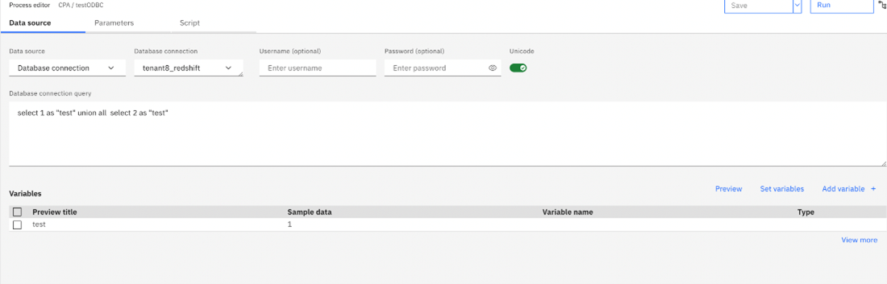

---
copyright:
  years: 2023
lastupdated: "2023-01-31"

keywords:
subcollection: planning-analytics

content-type: learn

---

{:codeblock: .codeblock}
{:note: .note}
{:pre: .pre}
{:shortdesc: .shortdesc}
{:screen: .screen}
{:table: .aria-labeledby="caption"}
{:tip: .tip}
{:video: .video}
{:external: target="_blank" .external}
{:step: data-tutorial-type='step'}

# Enabling ODBC connectivity
{: #ODBC_connectivity}

ODBC connectivity in {{site.data.keyword.PA_SaaS_full}} is provided by the Planning Analytics ODBC Data Connector.

The Planning Analytics ODBC Data Connector (sometimes referred to as ODBCIS) transforms local ODBC data sources to an OData compliant REST API service that can be used by the Planning Analytics Engine database. You can use this service as the ODBC data source for TurboIntegrator processes in {{site.data.keyword.planninganalytics_short}}. You can use processes to import data, create and maintain metadata/objects, and manage security on your Planning Analytics Engine database.

To use  the ODBCServiceRoot configuration parameter to specity the location of the service, complete the following steps:

1. On the Planning Analytics Workspace home page, click the **Administration** tile.

2. Click the **Databases** tile.

3. Select the database on which you want to set the ODBCDerviceRoot configuration parameter.

4. Click the **Configuration** tab.

5. Select **External Database**.

6. Enter the URL provided by the ODBC Data Connector in the **ODBCServiceRoot parameter** text box.

<!-- What URL? -->

<!--  -->

<!-- does this make the last photo irrelevant? Does 'at this time' refer to the beta? -->
<!-- The ODBCServiceRoot example URL with username and password. We should explain that the username and password will not always be required (post beta). We should also note the we only currently support a single ODBCServiceRoot URL at this point. You can only have a single ODBCIS per TM1 database at this time. If you wish to test multiple ODBCIS deployments you will need one TM1 database per ODBCIS.  -->

<!-- -ODBCIS must be configured with TLS using a well known certificate authority. The TM1 database will be unable to connect with ODBCIS if you are using your own certificate authority certs (i.e you generated your own Root and Intermediate certificates for signing the certificated used for ODBCIS).  A well-known certificate would be any certificate that your web browser would trust by default.

-The username and password that is used in the Turbo Integrator process is for the connection to ODBCIS (matches the client credentials defined in ODBCIS) and not the ODBC database username and password. The database username and password is stored in the ODBCIS configuration -->

For more information on using the Planning Analytics ODBC Data Connector to make on-prem data available to the Planning Analytics Engine in Planning Analytics as a Service, see [Using the IBM® Planning Analytics Data Connector](https://www.ibm.com/docs/en/planning-analytics/2.0.0?topic=engine-using-planning-analytics-odbc-data-connector).

For more information on using TurboIntegrator processes to import and manipulate data from an external data source, see [TurboIntegrator processes](https://www.ibm.com/docs/en/planning-analytics/2.0.0?topic=mipaw-turbointegrator-processes).
