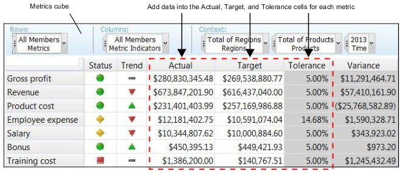

---
copyright:
  years: 2021
lastupdated: "2021-04-1"

keywords: 
subcollection: planning-analytics

content-type: tutorial
services: 
account-plan: lite 
completion-time: 15m 
---

{:codeblock: .codeblock}  
{:note: .note}
{:pre: .pre}
{:shortdesc: .shortdesc}
{:screen: .screen}  
{:table: .aria-labeledby="caption"}
{:tip: .tip}
{:video: .video}
{:external: target="_blank" .external}
{:step: data-tutorial-type='step'} 

# Adding data to a metrics cube
{: #Adding data to a metrics cube}
{: step}
You can use different approaches to add data to your metrics cube.
{: shortdesc}

## About this task

Use the metrics cube as the primary way to get your TM1® data into your scorecarding solution. You do this by adding your data to the Actual, Target, and Tolerance cells for each metric in the cube.

For example, to calculate the metric indicator values for the Revenue metric:

1. You populate the Actual and Target metric indicator cells with the respective values for Revenue.
1. You enter a Tolerance value to define an acceptable range for comparing actual revenue to target revenue.
1. The values in the Actual, Target, and Tolerance cells then provide the basis for calculating the other metric indicator values, such as Status, Trend, and Variance.

You can use any of the standard approaches for entering data into TM1 to populate the Actual, Target, and Tolerance cells in your metrics cube.

## Procedure

- Manually enter data. Enter values directly into the cells of your metrics cube. Manual data entry is described in the IBM TM1 Perspectives, TM1 Architect, and TM1 Web documentation, TM1 Applications documentation, and the Cognos Insight documentation.

- Use data spreading. Spread values across a range of cells in a view or spread values to the children of a consolidation. For more information, see [Spreading data in a cube view](https://www.ibm.com/docs/en/planning-analytics/2.0.0?topic=view-spreading-data-in-cube#task_i2t_dgz_vs).

- Import data with TM1 TurboIntegrator. Create a TurboIntegrator process to import data from any supported data source into a cube, as described in the TM1 TurboIntegrator documentation.

- Use rules-based calculations. Manually create rules that define data for a cube, as described in the TM1 Rules documentation. You can also define cube calculations or dimension calculations to generate rules that define data at the cube or dimension level. For example, you can enter a global value or expression for Tolerance in the Metrics Indicator editor that will apply the same tolerance level to all the metrics in your metrics cube.

For details about cube calculations, see [Cube Calculations](https://www.ibm.com/docs/en/SSD29G_2.0.0/com.ibm.swg.ba.cognos.prfmdl_ug.2.0.0.doc/c_prfmdl_cube_calculations.html#c_prfmdl_cube_calculations).

For details on dimension calculations, see [Dimension Calculations](https://www.ibm.com/docs/en/SSD29G_2.0.0/com.ibm.swg.ba.cognos.prfmdl_ug.2.0.0.doc/c_prfmdl_cube_calculations.html#c_prfmdl_cube_calculations).
