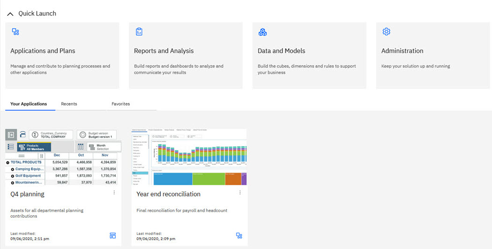

---
copyright:
  years: 2021
lastupdated: "2021-10-7"

keywords: 
subcollection: planning-analytics

content-type: tutorial
services: 
account-plan: lite, enterprise
completion-time: 15m 
---

{:codeblock: .codeblock}  
{:note: .note}
{:important: .important}
{:pre: .pre}
{:shortdesc: .shortdesc}
{:screen: .screen}  
{:table: .aria-labeledby="caption"}
{:tip: .tip}
{:video: .video}
{:external: target="_blank" .external}
{:step: data-tutorial-type='step'} 

# Use applications and plans to organize work 

Applications and plans let you organize logically related {{site.data.keyword.planninganalytics_full}} assets such as books, views, and websheets in containers.
{: shortdesc}

An application contains related assets that are grouped in sections. These sections might reflect the structure of your organization, planning and budgeting requirements, or any other relevant grouping of assets. While an application contains logically related assets, there are no implied or required actions associated with the assets or sections in an application.

A plan contains assets that are grouped in steps. These steps can represent discrete tasks or contributions that must be completed in a planning or budgeting process. While steps can be ordered in a plan, there is no requirement for contributors to complete the steps sequentially; they can be completed in any order. Steps can also be assigned a due date for contributions.

Access to sections in an application or steps in a plan are controlled by {{site.data.keyword.planninganalytics_short}} user group assignments. When a user group is assigned to a section or step, the security for the contained assets is updated to include the user group.

Application and plan security is applied only to {{site.data.keyword.planninganalytics_short}} user groups and roles. There are no links or dependencies to TM1 object security. It is the responsibility of the {{site.data.keyword.planninganalytics_short}} administrator to ensure that the {{site.data.keyword.planninganalytics_short}} user groups have the requisite TM1® security permissions to view and edit assets. 
{: important}

When you log in to {{site.data.keyword.planninganalytics_short}}, your applications and plans are visible on the `Your Applications` tab at the bottom of the Home page. Applications are identified by the Application  icon, while plans show the Plan  icon.

Administrators can see all applications and plans on the Home page, regardless of state or group assignments. Modelers, analysts and consumers can see open applications or plans in which they are a member of at least one of the user groups assigned to the included assets.

- [Applications](https://www.ibm.com/docs/en/planning-analytics/2.0.0?topic=work-applications)

  An application contains related assets, such as books, views, and websheets, that are grouped in sections. These sections might reflect the structure of your organization, planning and budgeting requirements, or any other relevant grouping of assets. While an application contains logically related assets, there are no implied or required actions associated with the assets or sections in an application.

- [Plans](https://www.ibm.com/docs/en/planning-analytics/2.0.0?topic=work-plans)

  A plan contains assets that are grouped in steps. These steps can represent discrete tasks or contributions that must be completed in a planning or budgeting process. Each step in a plan must be completed by contributing data to the books, views, and websheets in the step.

<!---
## Next steps
{: #anchor_value}

What's the single thing the user needs to do next? Think "guided journey." Either provide information that leads the user to production use,for example HA, how to make a service secure, or how to connect to on-premise data. Or you can point the user to another tutorial. Give a choice between two options max._
--->
