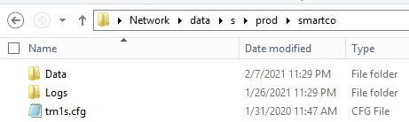

---
copyright:
  years: 2023
lastupdated: "2023-01-31"

keywords: 
subcollection: planning-analytics

content-type: tutorial
services: 
account-plan: lite 
completion-time: 15m 
---

{:codeblock: .codeblock}  
{:note: .note}
{:pre: .pre}
{:shortdesc: .shortdesc}
{:screen: .screen}  
{:table: .aria-labeledby="caption"}
{:tip: .tip}
{:video: .video}
{:external: target="_blank" .external}
{:step: data-tutorial-type='step'} 

# Creating a database
{: #Creating a database}
{: step}
{{site.data.keyword.planninganalytics_short}} users can create their own Planning Analytics databases by using Planning Analytics Workspace Administration.
{: shortdesc}

An outage is not required to create a new database.

All Planning Analytics databases are created in the prod folder. The default database is named TM1.

If the prod folder doesn't exist, it is created along with the Data and Logs folders, and the tm1s.cfg file. You can use the folder as is, or change the directory structure to organize the TM1 objects in a specific way. By default, all objects reside in the base directory. If the prod folder with valid subfolders and the tm1s.cfg file already exists, the folder is used for the new database.

The best practice is to keep the folder structure as shown in the following figure:

In this example, the name of the TM1 application is smartco. Therefore, for this TM1 application, the base directory is: \\data\s\prod\smartco.

The following conditions must be met when creating and using the TM1 database directory:
- The tm1s.cfg file must exist in the base directory.
- Any folders that you create must be within the base directory.
- The location or the name of the base directory cannot be changed.
  
Typically, customers create additional folders with the following names:
- Excel - contains Perspectives report and template definitions for TM1 Web.
- Files - used to transfer .txt data files.
  
The [list of settings in the tm1s.cfg file](https://www.ibm.com/docs/en/planning-analytics/2.0.0?topic=cloud-troubleshooting-planning-analytics) that you should not change is the same as for other TM1 databases. If you need to change any settings, use Planning Analytics Workspace Administration to ensure that you change the proper the settings.

All users with the Administrator role in Planning Analytics Workspace are given ADMIN access to the new TM1 database. For more information, see [Understand who is a default member of the ADMIN security group in TM1](https://www.ibm.com/docs/en/planning-analytics/2.0.0?topic=auc-understand-who-is-default-member-admin-security-group-in-tm1).

The default security mode 1 "admin" account for the new TM1 database has a randomly generated password. This password cannot be accessed by the Cloud Operations team, and therefore cannot be communicated to you through the Welcome Kit.

If access to the default security mode 1 "admin" account is required, a new password can be set by using the [AssignClientPassword](https://www.ibm.com/docs/en/planning-analytics/2.0.0?topic=functions-assignclientpassword) function using your IBMid administrator account.

If access control lists are enabled to control access to shared folders, the access controls are applied to the database as well. For more information, see [access control lists](https://www.ibm.com/docs/en/planning-analytics/2.0.0?topic=cloud-controlling-access-services-shared-folders) (the sections about user access to shared folders, and TM1 database access to data in shared folders).

## About this task

When you specify the TM1 database name, ensure that you follow rules regarding special characters, character lengths, and other operating system and process restrictions. The database name cannot:
- Have more than 75 characters
- Be blank
- Contain only spaces, and begin or end with a space
- Contain only periods (for example, '...'), and end with a period '.'
- Contain only the number 0
- Contain the following characters: \/":|<>+=;,?*@$`'}{%
- Contain the new line (\n) character

**Note:**  The TM1 database names are available publicly on the TM1 Web login screen if allow lists for web services are not applied. Choose a database name that is not sensitive, and implement allow lists for web services.

## Procedure
1. Log on to {{site.data.keyword.planninganalytics_short}}
1. In the Welcome page, click **Administration**.
1. Click **Databases**.
1. On the **Databases** tab, click **Add**. The **New database dialog** box is displayed.
1. In the **Database name** field, enter the name for your database. Ensure that the name complies with the restrictions that are specified earlier in this topic.
1. Click **Create**.

While the process runs in the background (asynchronously), you can work on other tasks, including adding another TM1 database. The process of creating multiple databases is performed in a sequential order, and not in parallel. Planning Analytics Workspace Administration continues to check the database creation process, and displays a message when the process is complete.

The database creation process, even for one database, might take a few minutes to complete, especially if access control lists to shared folders are applied. The time is even longer if you added multiple databases.

The new database or databases are added to the list of databases on the **Databases** tab.

7. Locate your newly added database name or names in the list of databases. To sort names in the alphabetical order, click the **Name** heading.

## What to do next
You can proceed to configure the database settings. For more information, see [Configure databases](https://www.ibm.com/docs/en/planning-analytics/2.0.0?topic=databases-configure).

To delete a TM1 database, use the self-service delete function in Planning Analytics Workspace Administration. For more information, see [Delete a database](https://www.ibm.com/docs/en/planning-analytics/2.0.0?topic=databases-configure).

**Note:** The self-service Rename function is not available for TM1 databases. You need to open a support ticket if you want to rename the database.

<!---
## Next steps
{: #anchor_value}

What's the single thing the user needs to do next? Think "guided journey." Either provide information that leads the user to production use, for example HA, how to make a service secure, or how to connect to on-premise data. Or you can point the user to another tutorial. Give a choice between two options max._
--->
