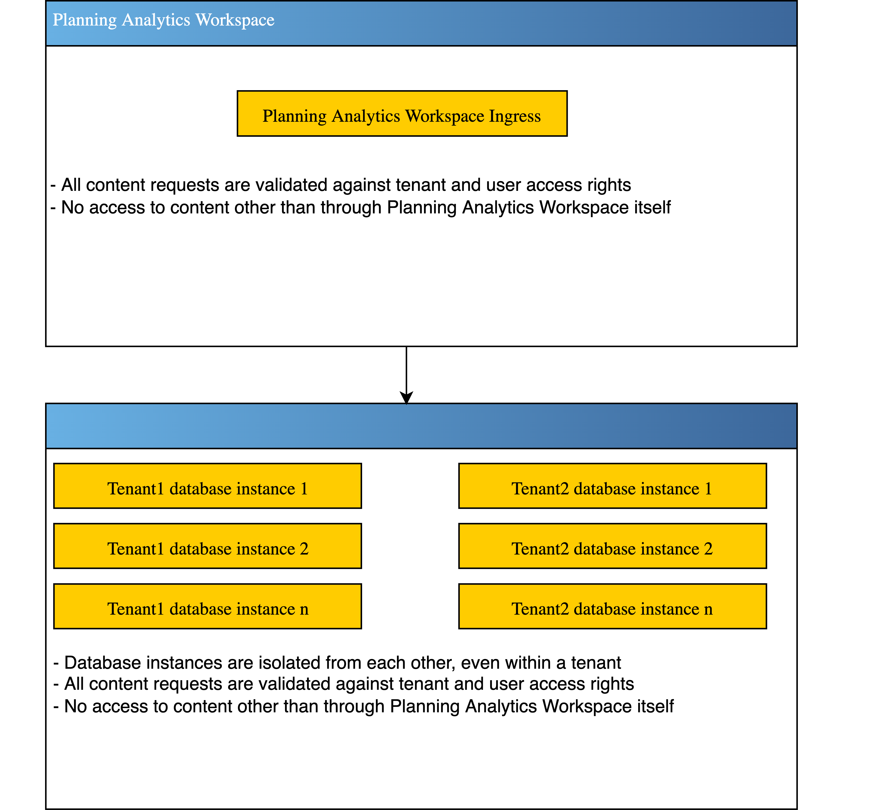

---
copyright:
  years: 2023
lastupdated: "2023-02-09"

keywords: architecture, workload isolation
subcollection: planning-analytics

content-type: howto
completion-time: 15m

---

{{site.data.keyword.attribute-definition-list}}

# Learning about {{site.data.keyword.PA_SaaS_short}} architecture and workload isolation
{: #pa_architecture_and_workload_isolation}

Planning Analytics Workspace within {{site.data.keyword.planninganalytics_short}} employs strict access controls, both at the tenant and user level, which ensures that information from one tenant is not accessible from another.
{: shortdesc}

## Planning Analytics as a Service architecture
{: #architecture}

This diagram illustrates how Planning Analytics Workspace within {{site.data.keyword.planninganalytics_short}} validates content requests and isolates database instances.

{: caption="Figure 1. Planning Analytics as a Service architecture" caption-side="bottom"}

## Planning Analytics as a Service workload isolation
{: #workload-isolation}

Isolation includes tenant-specific configuration such as workbooks and plans. In addition, all access to tenant data is only permitted via Planning Analytics Workspace, which ensures that all content requests are validated against configured tenant and user access.

Planning Analytics Engine instances are also isolated from each other, even within a tenant. This ensures that database content is not only segregrated from other tenants, but also segregated from groups of users within the same tenant.
