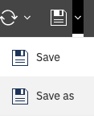
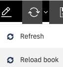

---
copyright:
  years: 2021
lastupdated: "2021-04-1"

keywords: 
subcollection: planning-analytics

content-type: tutorial
services: 
account-plan: lite 
completion-time: 15m 
---

{:codeblock: .codeblock}  
{:note: .note}
{:pre: .pre}
{:shortdesc: .shortdesc}
{:screen: .screen}  
{:table: .aria-labeledby="caption"}
{:tip: .tip}
{:video: .video}
{:external: target="_blank" .external}
{:step: data-tutorial-type='step'} 

# Saving and reloading a book
{: #Saving and reloading a book}
{: step}
You can access **Save as** from the **Save** menu, and **Reload** book from the **Refresh** menu.
{: shortdesc}

