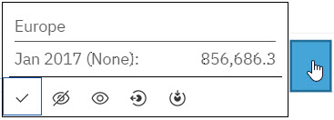
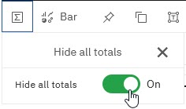

---
copyright:
  years: 2023
lastupdated: "2023-01-31"

keywords:
subcollection: planning-analytics

content-type: how-to
completion-time: 15m
---

{{site.data.keyword.attribute-definition-list}}

# Using visualizations in {{site.data.keyword.planninganalytics_short}}
{: #visualizations-in-pa}

You can use any of the visualizations that are described here to present data in {{site.data.keyword.planninganalytics_short}}.
{: shortdesc}

To change the visualization type for any view in a book:

1. Click the view.
1. Click the **Change visualization** icon . The label next to the icon indicates the type of visualization currently displayed for the view.
1. Click **All visualizations**.
1. Select the visualization you want to apply to the view.

**Note:** In some cases when you attempt to convert an exploration to a visualization, you might receive an error indicating that **Data for member is missing**. When this happens, {{site.data.keyword.planninganalytics_short}} cannot construct the requested visualization.
Here are some use reasons why this error can occur:

- Zero suppression is turned on in the view, resulting in the removal of a column member that is required to create the visualization.
- A calculation was removed, resulting in the removal of a column member that is required to create the visualization.
- Any other view action that could cause column members required by the visualization to be unavailable.
- Insufficient TM1 permissions in the view. For example, if User1 creates a view that includes members for which User2 does not have at least Read permission, User2 may encounter an error when trying to create a visualization.

When you right-click on a visualization member, you'll see the full abbreviated value of the member, along with several options to interact with the visualization.

{: caption="Figure 1. Visualization member options" caption-side="bottom"}

**Hide** 

  Hide the member in the visualization.

**Unhide all** 

  Reveal all hidden members in the visualization.

**Drill up** 

  Collapse the member to show its immediate parent.

**Drill down** 

  Reveal the members of a consolidation. You cannot drill down on a leaf member.

To hide totals in a visualization, click the **Hide all totals** button on the toolbar, then turn on the **Hide all totals** option.

To restore totals in the visualization, turn off the **Hide all totals** option.

- [Create a visualization directly in a book](https://www.ibm.com/docs/planning-analytics/2.0.0?topic=workspace-create-visualization-directly-in-book)

  You can build a visualization from scratch in a book, without having to convert an existing Exploration.

- [Visualizations available in {{site.data.keyword.planninganalytics_short}}](https://www.ibm.com/docs/planning-analytics/2.0.0?topic=workspace-visualizations-available-in-planning-analytics)

  The visualizations that can be created in {{site.data.keyword.planninganalytics_short}}.
